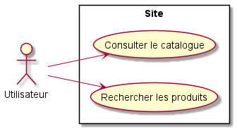
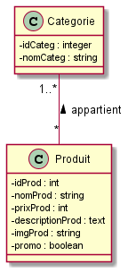

# Documentation - Ma petite entreprise

* ## Présentation du projet

Le projet sur lequel nous travaillons est un site nous présentant un catalogue de produits. Ces produits peuvent être rechercher grâce à un système de tri.

* ## Analyse

Le projet est composé d'un cas d'utilisation qui comporte pour l'utilisateur la possibilité de consulter le catalogue et de rechercher des porduits spécifiques, comme on le voit sur le diagramme de cas d'utilisation ci-dessous :

Diagramme de cas d'utilisation :

Diagramme de classes :

* ## Outils

    

   

